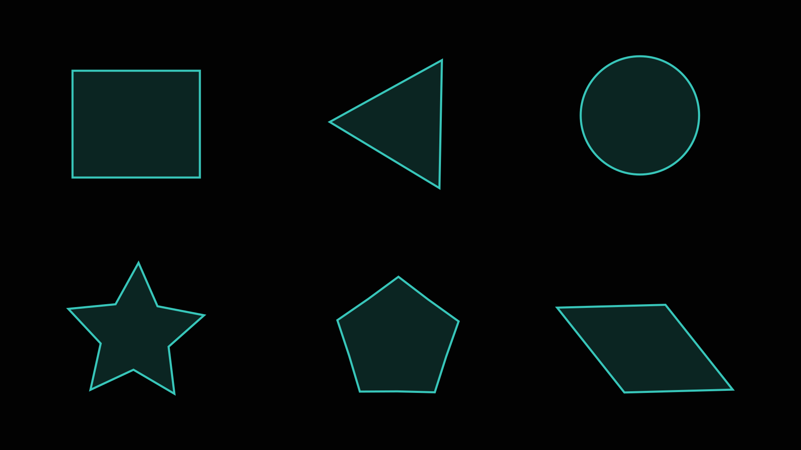
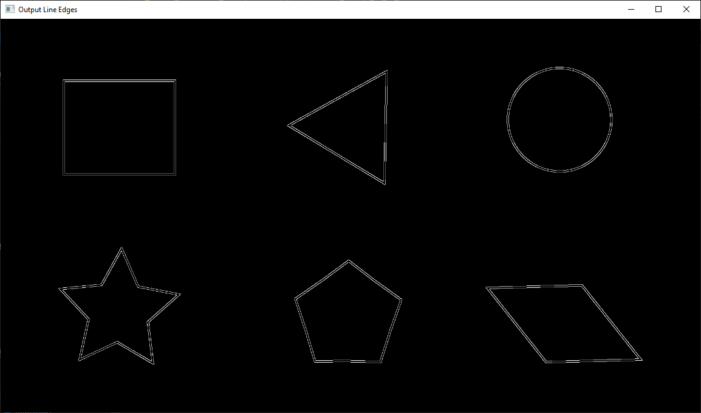
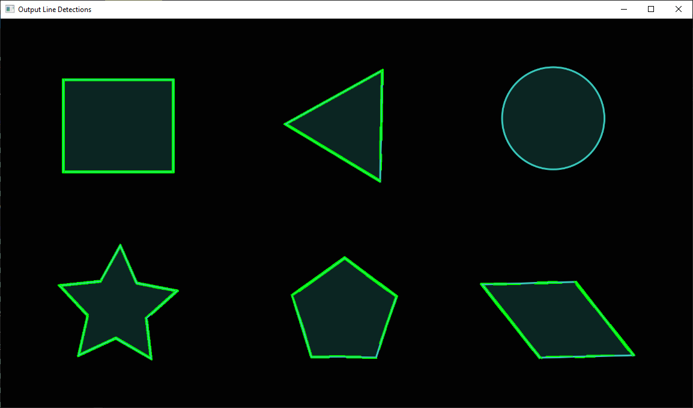
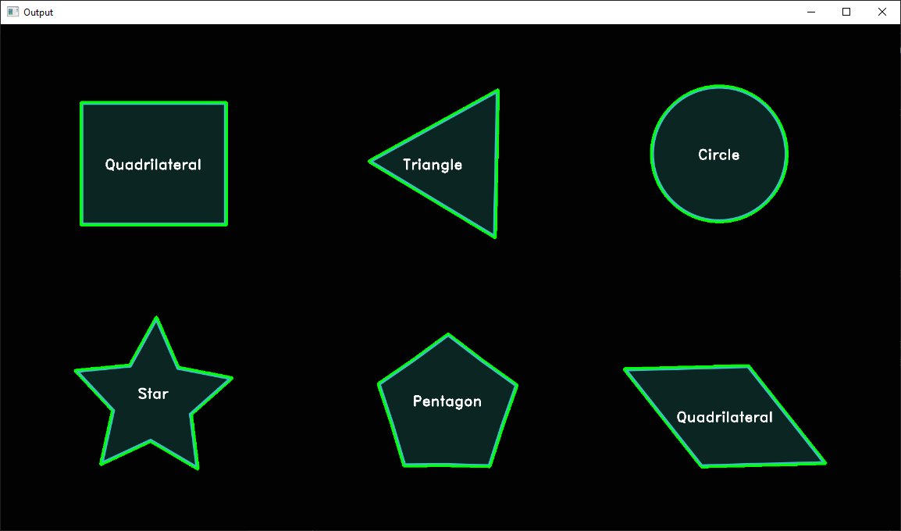

# Shape detection with Python using the OpenCV library

Python implementations of simple shape detection and identification using the OpenCV library.  

The input images with shapes can have a light/dark background as shown in the examples (input_shapes_light_bkg.png and input_shapes_dark_bkg.png) shown below and provided in the images folder.

<p align="center" width="100%">
  
</p>
<br>
<p align="center" width="100%">
  
</p>  

Lines and circles can be detected with the Hough transform. Other shapes can be detected using contours, where the borders of objects can be localized in an image. Contour detection is often the first step for many interesting applications, such as image-foreground extraction, simple-image segmentation, detection and recognition. 

## Table of Contents
- [Prerequisites](#prerequisites-heading)
- [Dependencies](#dependencies-heading)
- [Line Detection](#line-detection-heading)
- [Circle Detection](#circle-detection-heading)
- [Contour Detection](#contour-detection-heading)

<a name="prerequisites-heading"></a>
## Prerequisites
Python 3 (tested in version 3.12.2)

<a name="prerequisites-heading"></a>
## Dependencies

The only external dependency for these routines that needs to be installed is the OpenCV 4.11 library. The pip command is given below. 

```console
pip install opencv-python
```

### References
- [PyPI](https://pypi.org/project/opencv-python/)
- [Github](https://github.com/opencv/opencv-python)
- [Documentation](https://docs.opencv.org/4.5.4/index.html)


<a name="line-detection-heading"></a>
## Line Detection

The `Line_Detection_HoughLinesP.py` Python script reads in an image selected from a file dialog window, detects lines (segments) using the probiblistic Hough transform (HoughLinesP), an dislpays the image with the detected lines marked. It can be ran directly in the console with   
```console
python Line_Detection_HoughLinesP.py
```  
Select an input image image and the script will display the following images shown below. 
1. input image read in
2. line edges image
3. input image with the detected lines marked with a green border
<br>
<br>
<p align="center" width="100%">
  
</p>
<br>
<p align="center" width="100%">
  
</p>
<br>
<p align="center" width="100%">
  
</p>

<a name="circle-detection-heading"></a>
## Circle Detection

The `Circle_Detection_HoughCircles.py` Python script reads in an image selected from a file dialog window, detects circles using the HoughCircles function in OpenCV, an dislpays the image with the detected circles marked. It can be ran directly in the console with   
```console
python Circle_Detection_HoughCircles.py
```
Select an input image image and the script will display the following images shown below. 
1. input image read in
2. input image with the detected circles marked with a green border and a red dot in center
<br>
<br>
<p align="center" width="100%">
  
</p>
<br>
<p align="center" width="100%">
  
</p>

<a name="contour-detection-heading"></a>
## Contour Detection

The `Circle_Detection_HoughCircles.py` Python script reads in an image selected from a file dialog window and detects different shapes lines, polygonscircles,  using the HoughCircles function in OpenCV, an dislpays the image with the detected shapes marked. The different shapes it can identify are  

• ***Triangles***: a three-sided polygon with three corners and three sides  
• ***Quadrilaterals***: a four-sided polygon, having four edges (sides) and four corners (vertices)  
• ***Pentagons***: a five-sided polygon, having five edges (sides) and five corners (vertices)  
• ***Hexegons***: a five-sided polygon, having five edges (sides) and five corners (vertices)  
• ***Circles***: the set of all points in a plane that are equidistant from a given point, known as the center.

The script can be ran directly in the console with   
```console
python Contour_Detection.py
```
Select an input image image and the script will display the following images show below.
1. input image read in the input image
2. detections image with the shapes identified (with a green contour border) and labeled
<br>
<p align="center" width="100%">
  
</p>
<br>
<p align="center" width="100%">
  
</p>